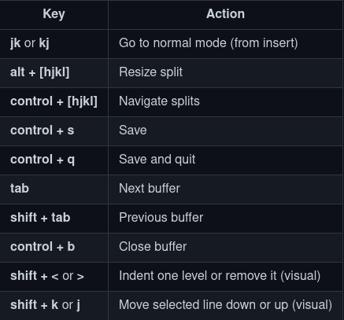

# vim
# Instalamos vim

Para distribuciones de Arch
```
sudo pacman -S neovim
```

Para distribuciones de Debian
```
sudo apt-get install neovim
```

## Instalamos ranger

```
sudo pacman -S ranger
```

### Instalacion del vim plug

```
sh -c 'curl -fLo "${XDG_DATA_HOME:-$HOME/.local/share}"/nvim/site/autoload/plug.vim --create-dirs \
       https://raw.githubusercontent.com/junegunn/vim-plug/master/plug.vim'
```

### Algunas cosas necesarias

```
sudo pacman -S nodejs npm python python-pip ruby rubygems
```

### Descargando paquetes de neovim

```
pip install neovim
gem install neovim
sudo npm i -g neovim
```

### Dependencias 
``` 
sudo pacman -S xsel fzf ripgrep fd the_silver_searcher prettier 
yay -S universal-ctags-git 
``` 

Hacemos un `:PlugInstall` dentro de vim

# Atajos

<br>


|comando|que hace   |
|-------|-----------|
|hjkl   | movimiento|
